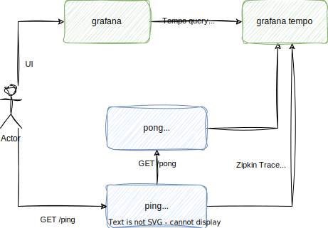

# Service-with-tracing

This is a SpringBoot service that demonstrates how to send traces in zipkin to a grafana backend.
It comprises two services, `ping` and `pong`, where `ping` sends a request to `pong`. 
This is then traced in grafana tempo. The traces are submitted in zipkin format.

### Used dependencies
- **SpringBoot**: Java framework
- **Micrometer Tracing with OpenTelemetry Bridge**: Metrics library
- **Grafana**: Visualization tool 
- **Grafana Tempo**: Tracing backend

### How to run
- **Run the grafana backend**: `cd docker && docker-compose up`
- **Run the services**:
    - service 1: `run/runWithPort.sh 8080 ping`
    - service 2: `run/runWithPort.sh 8081 pong`
 
